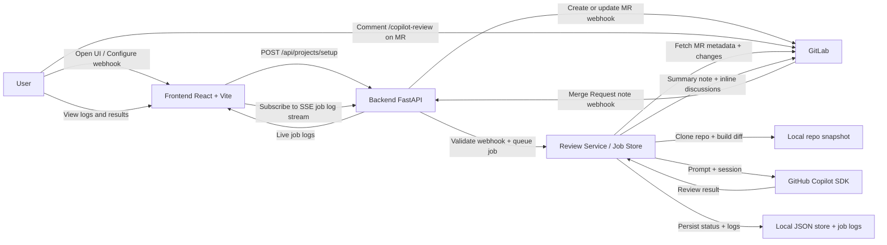

# GitLab Copilot MR Reviewer

English | [简体中文](README.zh-CN.md)

A GitLab Merge Request reviewer agent built with `github-copilot-sdk`, FastAPI, and React.

## Screenshots

### Main Dashboard


### Live Copilot Logs


## Features

- Automatically configures a GitLab project webhook from the web UI
- Listens for Merge Request note events from GitLab
- Triggers a review when a comment contains a configured keyword such as `/copilot-review`
- Clones the MR code, analyzes the diff with the Copilot SDK, and posts the review back to GitLab
- Posts both a summary note and inline discussions
- Supports per-project review language configuration
- Stores job status, logs, and project settings locally
- Streams live Copilot job logs over SSE
- Displays timestamps in `Asia/Shanghai`

## Stack

- `backend/`: Python FastAPI
- `frontend/`: React + Vite

## Architecture



## Interaction Flow

### 1. Setup Flow

1. The user opens the web UI and enters a GitLab project URL.
2. The frontend calls `/api/projects/setup` on FastAPI.
3. The backend uses the GitLab API to create or update a Merge Request note webhook.
4. The backend stores the project configuration locally, including the webhook secret, trigger keyword, and review language.

### 2. Review Trigger Flow

1. The user comments a trigger keyword such as `/copilot-review` on a GitLab Merge Request.
2. GitLab sends a note webhook to `/api/webhooks/gitlab`.
3. The backend validates the webhook token, checks that the event is an MR note, and verifies that the trigger keyword is present.
4. If valid, the backend creates a review job and schedules it in the background.

### 3. Copilot Review Flow

1. The review service fetches Merge Request metadata and changed files from GitLab.
2. The backend clones or updates a local repository snapshot and generates a unified diff.
3. The backend starts a Copilot SDK session, sends the review prompt, and streams model events into the job log.
4. The Copilot SDK returns a structured review result.
5. The backend converts that result into a summary note plus inline discussions and posts them back to GitLab.

### 4. User Feedback Flow

1. The frontend reads review job status and historical logs from the backend.
2. The frontend subscribes to the SSE log stream for live Copilot execution output.
3. The user sees queued, running, completed, or failed status in the UI and can inspect the full Copilot log stream.

## Requirements

- Use the repo-local Python environment: `./.venv`
- Copy `.env.example` to `.env` and fill in the required values
- Ensure GitHub Copilot is already authenticated on the machine
- Node.js and npm are required for frontend build/dev

## Configuration

Create your local config first:

```bash
cp .env.example .env
```

Required variables:

- `GITLAB_TOKEN`: GitLab token with API access
- `PUBLIC_BASE_URL`: Public base URL reachable by GitLab webhook delivery

Common optional variables:

- `APP_PORT`: Backend/UI unified port in production, default `8001`
- `CORS_ORIGINS`: Comma-separated list or JSON array
- `REVIEW_TRIGGER_KEYWORD`: Default trigger keyword
- `DEFAULT_REVIEW_LANGUAGE`: Default review language
- `COPILOT_MODEL`: Copilot model name
- `COPILOT_TIMEOUT_SECONDS`: Copilot review timeout in seconds, default `3600`
- `INLINE_MIN_SEVERITY`: Minimum inline severity, default `medium`

See `.env.example` for the full variable list.

## Development Run

Backend:

```bash
./.venv/bin/pip install -r backend/requirements.txt
./.venv/bin/python backend/run.py
```

Frontend:

```bash
cd frontend
npm install
npm run dev
```

Development URLs:

- Frontend: `http://localhost:5173`
- Backend API: `http://localhost:8001`

Notes:

- In development, Vite now proxies `/api` to `http://localhost:8001`
- You usually do **not** need to set `VITE_API_BASE`

## Production Run

In production, the frontend is built once and served by FastAPI on the **same port** as the backend API.
That means both UI pages and `/api/*` are exposed from a single service, defaulting to port `8001`.

### 1. Install dependencies

```bash
./.venv/bin/pip install -r backend/requirements.txt
cd frontend
npm ci
cd ..
```

### 2. Build the frontend

```bash
cd frontend
npm run build
cd ..
```

This generates `frontend/dist`, which FastAPI serves automatically.

### 3. Start the production service

```bash
./.venv/bin/python backend/run.py
```

Production URL:

- App + API: `http://localhost:8001`

Examples:

- UI homepage: `http://localhost:8001/`
- API health: `http://localhost:8001/api/health`
- GitLab webhook: `http://localhost:8001/api/webhooks/gitlab`

## Optional Reverse Proxy

If you place Nginx or another reverse proxy in front, keep FastAPI on `127.0.0.1:8001` and proxy all traffic to it.
Because the frontend is already served by FastAPI, you still only need one upstream app port.

## Usage

1. Open the web UI
2. Enter a GitLab project URL
3. Choose the trigger keyword and review language
4. Click **Configure Webhook**
5. Add the trigger keyword in an MR comment, for example `/copilot-review`
6. Wait for Copilot to finish and post the review back to the MR
7. Open the job log viewer to inspect the live SSE stream

## Default Local Values

- GitLab Project: `https://gitlab.com/agentic-devops/demo-app-02`
- Public Webhook Base URL: `https://lkjdp2fh-8001.jpe1.devtunnels.ms`
- Default trigger keyword: `/copilot-review`

## Data Storage

- Project configs: `backend/data/project_configs.json`
- Review jobs: `backend/data/review_jobs.json`
- Job logs: `backend/data/job_logs/`
