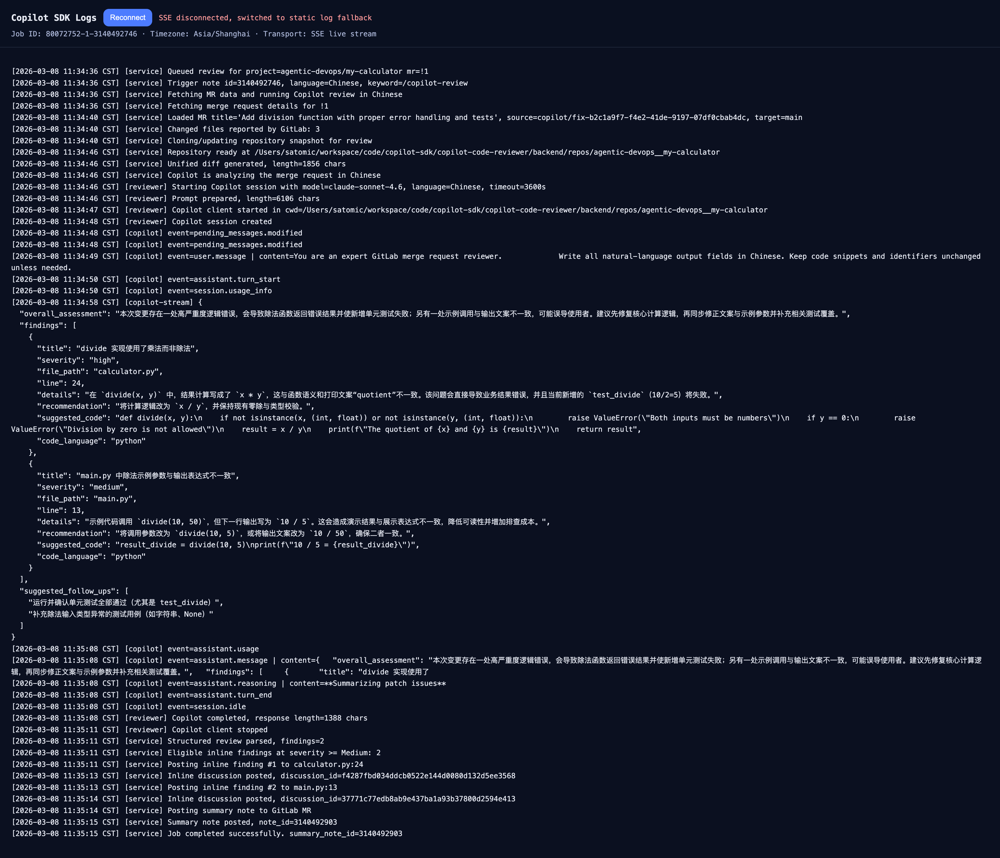

# GitLab Copilot MR Reviewer

[English](README.md) | 简体中文

这是一个基于 `github-copilot-sdk`、FastAPI 和 React 的 GitLab Merge Request 审查 Agent。

## 截图预览

### 主页面


### Copilot 实时日志



## 功能

- 在前端页面输入 GitLab 项目地址后，自动通过 GitLab API 配置项目 webhook
- 监听 GitLab 的 Merge Request note 事件
- 当评论中出现触发关键字（例如 `/copilot-review`）时自动发起审查
- 拉取 MR 代码和 diff，调用 Copilot SDK 进行分析，并将结果回写到 GitLab
- 同时回写总结评论和行级 inline discussion
- 支持按项目配置 Review 输出语言
- 本地持久化项目配置、任务状态和日志
- 支持通过 SSE 实时查看 Copilot 任务日志
- 所有时间统一按 `Asia/Shanghai` 展示

## 技术栈

- `backend/`：Python FastAPI
- `frontend/`：React + Vite

## 架构图

```mermaid
flowchart LR
	U[用户] -->|打开页面 / 配置 Webhook| FE[前端 React + Vite]
	FE -->|POST /api/projects/setup| BE[后端 FastAPI]
	BE -->|创建或更新 MR Webhook| GL[GitLab]

	U -->|在 MR 评论中输入 /copilot-review| GL
	GL -->|Merge Request note webhook| BE
	BE -->|校验 Webhook 并创建任务| JOB[Review Service / Job Store]
	JOB -->|获取 MR 元数据与变更| GL
	JOB -->|克隆仓库并生成 diff| REPO[本地仓库快照]
	JOB -->|构造 Prompt 并创建会话| SDK[GitHub Copilot SDK]
	SDK -->|返回 Review 结果| JOB
	JOB -->|回写总结评论与行级讨论| GL

	JOB -->|持久化状态与日志| STORE[本地 JSON 存储 + 任务日志]
	FE -->|SSE /api/review-jobs/{job_id}/logs/stream| BE
	BE -->|实时日志流| FE
	U -->|查看日志与审查结果| FE
```

## 交互逻辑

### 1. 配置流程

1. 用户打开前端页面并输入 GitLab 项目地址。
2. 前端调用 FastAPI 的 `/api/projects/setup`。
3. 后端通过 GitLab API 创建或更新 Merge Request note webhook。
4. 后端把项目配置持久化到本地，包括 webhook secret、触发关键字和 Review 语言。

### 2. 触发审查流程

1. 用户在 GitLab Merge Request 评论区输入触发词，例如 `/copilot-review`。
2. GitLab 向 `/api/webhooks/gitlab` 发送 note webhook。
3. 后端校验 webhook token，确认事件类型是 MR note，并检查评论中是否包含触发关键字。
4. 如果校验通过，后端创建一个 review job，并放入后台任务执行。

### 3. Copilot 审查流程

1. Review Service 从 GitLab 拉取 Merge Request 元数据和变更文件。
2. 后端克隆或更新本地仓库快照，并生成统一 diff。
3. 后端启动 Copilot SDK 会话，发送审查 Prompt，并把模型事件持续写入任务日志。
4. Copilot SDK 返回结构化审查结果。
5. 后端把结果整理为总结评论和行级 discussion，再回写到 GitLab。

### 4. 用户查看反馈流程

1. 前端从后端读取任务状态和历史日志。
2. 前端通过 SSE 订阅实时日志流，展示 Copilot 的执行过程。
3. 用户可以在 UI 中看到 queued、running、completed、failed 等状态，并查看完整日志与最终审查结果。

## 环境要求

- 必须使用仓库内的 Python 虚拟环境：`./.venv`
- 先复制 `.env.example` 为 `.env`，再填写所需配置
- 本机需要已经登录可用的 GitHub Copilot
- 前端开发/构建需要 Node.js 和 npm

## 配置说明

先创建本地配置文件：

```bash
cp .env.example .env
```

必填变量：

- `GITLAB_TOKEN`：具备 API 权限的 GitLab Token
- `PUBLIC_BASE_URL`：GitLab 能访问到的公网回调地址前缀

常用可选变量：

- `APP_PORT`：生产环境前后端统一端口，默认 `8001`
- `CORS_ORIGINS`：逗号分隔字符串或 JSON 数组
- `REVIEW_TRIGGER_KEYWORD`：默认触发关键字
- `DEFAULT_REVIEW_LANGUAGE`：默认 Review 语言
- `COPILOT_MODEL`：Copilot 使用的模型名
- `COPILOT_TIMEOUT_SECONDS`：Copilot Review 超时时间（秒），默认 `3600`
- `INLINE_MIN_SEVERITY`：行级评论最低严重级别，默认 `medium`

完整变量列表请参考 `.env.example`。

## 开发环境运行

后端：

```bash
./.venv/bin/pip install -r backend/requirements.txt
./.venv/bin/python backend/run.py
```

前端：

```bash
cd frontend
npm install
npm run dev
```

开发环境地址：

- 前端：`http://localhost:5173`
- 后端 API：`http://localhost:8001`

说明：

- 开发模式下，Vite 已经把 `/api` 自动代理到 `http://localhost:8001`
- 一般不需要额外设置 `VITE_API_BASE`

## 生产环境运行

生产环境下，前端会先构建为静态文件，再由 FastAPI 在**同一个端口**统一提供服务。
也就是说，页面和 `/api/*` 都走同一个服务，默认端口为 `8001`。

### 1. 安装依赖

```bash
./.venv/bin/pip install -r backend/requirements.txt
cd frontend
npm ci
cd ..
```

### 2. 构建前端

```bash
cd frontend
npm run build
cd ..
```

构建完成后会生成 `frontend/dist`，FastAPI 会自动托管该目录。

### 3. 启动生产服务

```bash
./.venv/bin/python backend/run.py
```

生产环境访问地址：

- 页面 + API：`http://localhost:8001`

示例：

- 首页：`http://localhost:8001/`
- 健康检查：`http://localhost:8001/api/health`
- GitLab Webhook：`http://localhost:8001/api/webhooks/gitlab`

## 可选反向代理

如果需要挂在 Nginx 或其他反向代理后面，可以让 FastAPI 继续监听 `127.0.0.1:8001`，然后把所有流量反代过去。
由于前端静态资源已经由 FastAPI 提供，所以后端仍然只需要暴露一个应用端口。

## 使用方式

1. 打开前端页面
2. 输入 GitLab 项目地址
3. 选择触发关键字和 Review 输出语言
4. 点击 **配置 Webhook**
5. 到对应 MR 评论区输入触发词，例如 `/copilot-review`
6. 等待 Copilot 完成分析并回写结果
7. 打开日志查看页，实时观察 SSE 推送的执行日志

## 当前本地默认值

- GitLab Project：`https://gitlab.com/agentic-devops/demo-app-02`
- Public Webhook Base URL：`https://lkjdp2fh-8001.jpe1.devtunnels.ms`
- 默认触发词：`/copilot-review`

## 数据存储

- 项目配置：`backend/data/project_configs.json`
- Review 任务：`backend/data/review_jobs.json`
- 任务日志：`backend/data/job_logs/`

